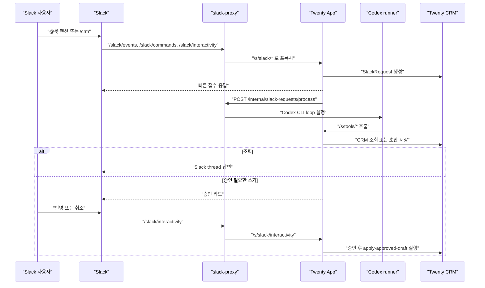

# 다우 Slack Agent

`다우 Slack Agent`는 Slack 대화를 Twenty CRM 작업으로 연결하는 Twenty 앱 패키지입니다. Slack ingress와 승인/감사 로그는 Twenty 앱이 담당하고, CRM 조회/초안 판단은 `slack-proxy` 안의 Codex runner가 수행합니다.

이 저장소는 Twenty 코어 포크가 아닙니다. Twenty 앱 tarball과 별도 `slack-proxy` 컨테이너를 함께 배포해서 운영합니다.

참고 문서:
- [Twenty Apps - Building](https://docs.twenty.com/developers/extend/apps/building)
- [Twenty Apps - Publishing](https://docs.twenty.com/developers/extend/apps/publishing)

## 현재 구조



핵심 원칙:
- Slack App 설정은 `/slack/*` 공개 경로만 바라봅니다.
- Twenty 앱의 `/s/slack/*`와 `/s/tools/*`는 직접 외부에 노출하지 않습니다.
- `process-slack-intake`는 AI 추론을 하지 않고 runner handoff만 수행합니다.
- Codex는 CRM을 직접 쓰지 않습니다. runner tool route를 통해 조회/초안 생성만 하며, 승인 후 실제 write는 `apply-approved-draft`가 수행합니다.
- Codex 인증은 ChatGPT 구독 로그인 기반 Codex CLI 캐시를 사용합니다. OpenAI API key 기반 호출은 현재 범위가 아닙니다.

## 주요 기능

### CRM 조회

예시:
- `@Daou-CRM-slack 미래금융 영업기회 보여줘`
- `/crm 최근 3개월간 실적 저조한 파트너사 분석해줘`
- `/crm Adobe 갱신 리스크 있는 라이선스 정리해줘`

동작:
1. Slack 요청을 `SlackRequest`로 저장합니다.
2. runner가 `search-*` tool을 호출해 CRM 데이터를 수집합니다.
3. Codex가 한국어 답변을 만듭니다.
4. `save-query-answer`가 `ANSWERED` 상태와 thread memory를 저장합니다.
5. `post-slack-reply`가 Slack thread에 답변합니다.

### 일반 CRM 생성

단순 생성 요청은 `create-record` tool을 사용할 수 있습니다. 생성이 즉시 실행되면 final mode는 `applied`여야 하며, 실행 결과가 `save-applied-result`로 저장됩니다.

예시:
- `/crm 미래금융 회사 생성해줘`
- `/crm A은행 담당자 김민수 추가해줘`

### 수정/삭제 승인 플로우

수정과 삭제는 항상 승인 대상입니다.

동작:
1. Codex가 `update-record` 또는 `delete-record`를 호출합니다.
2. tool route는 실제 mutation을 실행하지 않고 대상/변경사항 review metadata를 반환합니다.
3. runner가 `write_draft`로 종료합니다.
4. `save-write-draft`가 `AWAITING_CONFIRMATION` 상태와 Slack 승인 카드를 저장합니다.
5. 사용자가 승인하면 `apply-approved-draft`가 실제 update/delete를 실행합니다.

### 신규 리드 패키지

`신규 리드 등록`, `잠재고객 등록`, `CRM에 등록` 계열 요청은 generic `create-record`가 아니라 `create-lead-package`를 우선 사용합니다.

예시:

```text
@Daou-CRM-slack CRM에 신규 리드로 등록해줘.
고객사: 서광건설엔지니어링
담당자: 박성훈
직책: BIM혁신팀 수석
이메일: sh.park@seogwang-demo.co.kr
관심 솔루션/벤더: Autodesk AEC Collection / Autodesk
예상 규모: AEC Collection 60석, 교육 및 초기 컨설팅 포함 요청
예산: 1차 연 1.2억원 내외
도입 희망 시점: 2026년 3분기
다음 액션: 라이선스 견적 초안과 BIM 컨설팅 범위안 같이 제안해줘
```

`create-lead-package` 결과:
- 회사는 이름 기준으로 재사용하거나 생성 예정으로 둡니다.
- 담당자는 이메일 우선, 없으면 이름+회사 기준으로 재사용하거나 생성 예정으로 둡니다.
- 영업기회는 항상 신규 생성 예정입니다.
- 메모는 항상 생성 예정이며, 구조화 필드에 못 넣는 리드 맥락을 보존합니다.
- 다음 액션이 있으면 task 생성 예정으로 둡니다.
- 승인 전에는 어떤 CRM create mutation도 실행하지 않습니다.

승인 후 실행 순서:

```text
company -> person -> opportunity -> note -> task
```

보호 장치:
- `create-lead-package` 호출 후 `create-record` 호출은 runner가 차단합니다.
- 리드 패키지 draft는 model final JSON이 아니라 tool preview 결과를 source of truth로 저장합니다.
- 모델이 draft actions를 덮어써도 저장 시 반영되지 않습니다.

## Same-Thread Memory

같은 Slack thread 안에서는 대화 맥락을 이어갑니다.

메모리 키:

```text
slackTeamId + slackChannelId + slackThreadTs
```

저장 객체:
- `SlackRequest`: 요청 단위 audit log
- `slackThreadContext`: 같은 thread의 conversational state

`slackThreadContext`가 보관하는 정보:
- 최근 6턴 대화
- 압축 summary
- 선택된 company/person/opportunity/license ids
- 최근 조회 결과 축약본
- thread당 하나의 active pending approval

다른 Slack thread, 다른 채널, 다른 사용자의 thread와 memory는 공유하지 않습니다.

## Twenty 앱 리소스

### 객체

설치 시 생성되는 주요 객체:
- `Slack 요청` (`slackRequest`)
- `Slack 스레드 컨텍스트` (`slackThreadContext`)

`Slack 요청` 주요 상태:
- `RECEIVED`: Slack ingress에서 저장됨
- `PROCESSING`: runner handoff 시작
- `CLASSIFIED`: 이전 호환 상태
- `AWAITING_CONFIRMATION`: 승인 대기
- `CONFIRMED`: Slack에서 승인됨
- `APPLIED`: 실제 CRM 반영 완료
- `ANSWERED`: 조회 응답 완료
- `REJECTED`: 사용자가 취소
- `ERROR`: 처리 실패

주의:
- `approvedByWorkspaceMemberId`에는 현재 Twenty member id가 아니라 Slack user id가 저장됩니다.

### 공개 Slack routes

Twenty 앱 내부 route:
- `POST /s/slack/events`
- `POST /s/slack/commands`
- `POST /s/slack/interactivity`

운영에서는 Slack이 이 경로를 직접 호출하지 않고, `slack-proxy`의 `/slack/*` 경로를 호출합니다.

### Runner tool routes

모든 `/s/tools/*` route는 `x-tool-shared-secret`으로 보호됩니다.

Bootstrap/internal:
- `POST /s/tools/load-slack-request`
- `POST /s/tools/load-thread-context`
- `POST /s/tools/get-tool-catalog`

Read tools:
- `POST /s/tools/search-companies`
- `POST /s/tools/search-people`
- `POST /s/tools/search-opportunities`
- `POST /s/tools/search-licenses`
- `POST /s/tools/search-activities`

Write/preview tools:
- `POST /s/tools/create-record`
- `POST /s/tools/create-lead-package`
- `POST /s/tools/update-record`
- `POST /s/tools/delete-record`

Persistence/Slack tools:
- `POST /s/tools/save-query-answer`
- `POST /s/tools/save-applied-result`
- `POST /s/tools/save-write-draft`
- `POST /s/tools/mark-runner-error`
- `POST /s/tools/post-slack-reply`

Codex에게 직접 노출되는 tool은 tool catalog의 `modelVisibleTools`뿐입니다. 저장/응답/오류 처리 tool은 runner control flow 전용입니다.

## Tool 정책

Model-visible tools:
- `search-companies`
- `search-people`
- `search-opportunities`
- `search-licenses`
- `search-activities`
- `create-record`
- `create-lead-package`
- `update-record`
- `delete-record`

정책:
- 조회/분석/보고 요청은 최소 하나 이상의 `search-*` tool 호출 후 답변합니다.
- 넓은 조회는 `{"query": ""}`로 검색할 수 있습니다.
- 신규 리드 등록은 `create-lead-package`를 사용하고 반드시 `write_draft`로 종료합니다.
- 단순 create는 `create-record` 후 `applied`로 종료할 수 있습니다.
- update/delete는 `write_draft`로 종료하고 Slack 승인을 기다립니다.
- 모든 성공 final은 `threadContextPatch`를 포함해야 합니다.

## Slack 설정

Slack App 설정 URL:
- Events API Request URL: `https://<your-domain>/slack/events`
- Slash Command `/crm` Request URL: `https://<your-domain>/slack/commands`
- Interactivity Request URL: `https://<your-domain>/slack/interactivity`

필수 Bot Token Scope:
- `app_mentions:read`
- `chat:write`
- `commands`

필요 시 추가:
- `chat:write.public`

Events API 구독:
- `app_mention`

Slack URL에 `/s/slack/*`를 등록하지 않습니다. `/s/*`는 Twenty 내부 route이고, 운영 ingress는 `slack-proxy`가 담당합니다.

## Twenty Application Variables

`Settings > Applications > 다우 Slack Agent > 구성`에서 설정합니다.

| 변수명 | 필수 | 설명 |
| --- | --- | --- |
| `SLACK_BOT_TOKEN` | 필수 | Slack 답변/승인 카드 전송용 bot token |
| `SLACK_SIGNING_SECRET` | 필수 | Slack request signature 검증용 secret |
| `SLACK_VERIFICATION_TOKEN` | 선택 | legacy/fallback 검증 token |
| `SLACK_APP_TOKEN` | 선택 | 향후 Socket Mode용 예약 변수 |
| `RUNNER_BASE_URL` | 필수 | Twenty 앱이 호출할 runner base URL. docker compose 기준 `http://slack-proxy:8080` |
| `RUNNER_SHARED_SECRET` | 필수 | Twenty 앱 -> runner 호출 보호 secret |
| `TOOL_SHARED_SECRET` | 필수 | runner -> `/s/tools/*` 호출 보호 secret |
| `TWENTY_BASE_URL` | 필수 | Slack 답변에 들어갈 public Twenty URL |
| `TWENTY_WORKSPACE_API_KEY` | 필수 권장 | app-scoped schema에 없는 CRM 객체를 조회/쓰기 위한 workspace API key |
| `ALLOWED_CHANNEL_IDS` | 선택 | 허용 Slack 채널 ID 목록, 쉼표 구분 |
| `ADMIN_SLACK_USER_IDS` | 선택 | 운영 알림 대상 Slack user IDs |
| `MANAGEMENT_CHANNEL_ID` | 선택 | 주간 브리핑/운영 알림 채널 |
| `VENDOR_ALIGNED_STAGE_VALUES` | 선택 | 벤더 필수 점검 대상 opportunity stage values |
| `QUOTE_STAGE_VALUES` | 선택 | 견적/솔루션 점검 대상 opportunity stage values |

현재 버전은 `ANTHROPIC_API_KEY`, `ANTHROPIC_MODEL`, `OPENAI_API_KEY`를 사용하지 않습니다.

## slack-proxy 환경변수

`slack-proxy` 컨테이너에 필요한 값:

| 변수명 | 필수 | 설명 |
| --- | --- | --- |
| `PORT` | 선택 | 기본 `8080` |
| `TWENTY_INTERNAL_URL` | 필수 | docker compose 기준 `http://server:3000` |
| `RUNNER_SHARED_SECRET` | 필수 | `/internal/slack-requests/process` 보호 secret |
| `TOOL_SHARED_SECRET` | 필수 | `/s/tools/*` 호출 시 전달할 secret |
| `CODEX_HOME` | 필수 | Codex 로그인 캐시 저장 경로. persistent volume 권장 |
| `CODEX_MODEL` | 선택 | Codex 모델 override |
| `CODEX_WORKDIR` | 선택 | Codex CLI working directory |
| `CODEX_BINARY` | 선택 | Codex 실행 파일 경로 override |

`RUNNER_SHARED_SECRET`과 `TOOL_SHARED_SECRET`은 Twenty 앱 구성값과 proxy 컨테이너 환경변수가 서로 일치해야 합니다.

## Codex runner 운영

현재 runner는 `slack-proxy` 컨테이너 안에서 `@openai/codex` CLI를 실행합니다.

초기 설정:
1. `CODEX_HOME`을 persistent volume에 연결합니다.
2. 컨테이너 안에서 Codex 로그인을 완료합니다.
3. `/var/lib/codex/auth.json` 같은 인증 캐시가 남는지 확인합니다.
4. 컨테이너 재시작 후에도 캐시가 유지되는지 확인합니다.

예시:

```bash
docker compose exec slack-proxy sh
codex
# remote/headless 환경에서는 Device Code 로그인 사용
```

CLI smoke test:

```bash
docker compose exec -T slack-proxy sh -c 'printf "Reply only with OK" | codex exec --skip-git-repo-check --full-auto --sandbox read-only --color never --json -'
```

선택적으로 enterprise sales skill을 설치할 수 있습니다. 현재 prompt는 skill이 사용 가능하면 영업 전략 판단에 활용하라고 지시합니다.

```bash
npx skills add https://github.com/refoundai/lenny-skills --skill enterprise-sales
```

## docker-compose 예시

```yaml
services:
  slack-proxy:
    build:
      context: ./twenty_slack_app/slack-proxy
    environment:
      PORT: 8080
      TWENTY_INTERNAL_URL: http://server:3000
      RUNNER_SHARED_SECRET: ${RUNNER_SHARED_SECRET}
      TOOL_SHARED_SECRET: ${TOOL_SHARED_SECRET}
      CODEX_HOME: /var/lib/codex
    volumes:
      - codex-home:/var/lib/codex
    depends_on:
      server:
        condition: service_healthy
    restart: always

volumes:
  codex-home:
```

## Caddy 예시

```caddy
<your-domain> {
  handle /slack/* {
    reverse_proxy slack-proxy:8080
  }

  handle {
    reverse_proxy server:3000
  }
}
```

## 배포

### 1. Twenty 앱 tarball 배포

Windows에서 Azure Linux Twenty 서버로 배포할 때는 custom deploy script를 사용합니다.

```bash
yarn deploy:linux-safe --remote azure-prod --install
```

API key를 직접 지정할 수도 있습니다.

```bash
node scripts/twenty-linux-deploy.mjs \
  --api-url https://<your-domain> \
  --api-key <twenty-api-key> \
  --install
```

스크립트가 하는 일:
- `yarn twenty build --tarball`
- manifest path를 Linux 호환 POSIX path로 정규화
- role permission flag shape 보정
- tarball upload
- install mutation 실행

같은 앱을 다시 배포할 때는 `package.json`의 `version`을 올려야 합니다.

### 2. slack-proxy 배포

Twenty 앱만 재설치해서는 runner 코드가 바뀌지 않습니다. `slack-proxy`도 새 코드로 재빌드해야 합니다.

Azure VM 예시:

```bash
cd ~/daoudata/twenty/twenty_slack_app
git fetch origin
git checkout codex/lead-package-tool
git pull --ff-only origin codex/lead-package-tool

cd ~/daoudata/twenty
docker compose up -d --build slack-proxy
docker compose logs --tail=80 slack-proxy
docker compose ps slack-proxy
```

정상 확인:

```bash
docker compose exec -T slack-proxy sh -c 'wget -S -O- http://127.0.0.1:8080/internal/slack-requests/process 2>&1 || true'
```

`GET` 요청은 `405 Method Not Allowed`가 정상입니다. 실제 runner endpoint는 `POST` + `x-runner-shared-secret`만 허용합니다.

## 로컬 개발

```bash
yarn
yarn test
yarn typecheck
yarn lint
yarn build
```

이 Windows 환경에서 `yarn typecheck`가 shell PATH 문제로 실패하면 직접 실행합니다.

```bash
./node_modules/.bin/tsc.cmd -p tsconfig.typecheck.json
```

단일 테스트:

```bash
yarn vitest run src/__tests__/slack-proxy.test.ts
yarn vitest run src/__tests__/crm-write.test.ts
```

통합 테스트:

```bash
RUN_TWENTY_INTEGRATION_TESTS=true yarn test:integration
```

## ATDD 문서

Acceptance scenarios:
- `docs/atdd/codex-runner-slack-processing.md`
- `docs/atdd/slack-thread-memory.md`

중요 회귀 테스트:
- `src/__tests__/slack-proxy.test.ts`
- `src/__tests__/codex-tools.test.ts`
- `src/__tests__/crm-write.test.ts`
- `src/__tests__/slack-thread-context-service.test.ts`
- `src/__tests__/slack-orchestrator.test.ts`

## 운영 체크리스트

배포 후 확인:
- Twenty 앱 버전이 최신인지 확인합니다.
- `SLACK_BOT_TOKEN`, `SLACK_SIGNING_SECRET`, `RUNNER_BASE_URL`, `RUNNER_SHARED_SECRET`, `TOOL_SHARED_SECRET`, `TWENTY_BASE_URL`, `TWENTY_WORKSPACE_API_KEY`가 설정되어 있는지 확인합니다.
- proxy 컨테이너에 `RUNNER_SHARED_SECRET`, `TOOL_SHARED_SECRET`, `TWENTY_INTERNAL_URL`, `CODEX_HOME`이 설정되어 있는지 확인합니다.
- `CODEX_HOME`이 persistent volume인지 확인합니다.
- Codex CLI 로그인이 유지되는지 확인합니다.
- Caddy가 `/slack/*`를 `slack-proxy:8080`으로 보내는지 확인합니다.
- Slack App URL이 `/slack/events`, `/slack/commands`, `/slack/interactivity`인지 확인합니다.
- Slack 채널에 봇이 초대되어 있는지 확인합니다.

## 트러블슈팅

### Slack에서 봇 답변이 없을 때

- `docker compose logs -f slack-proxy`로 proxy 요청이 들어오는지 확인합니다.
- Twenty UI의 `Slack 요청`에서 상태가 `RECEIVED`, `PROCESSING`, `ERROR` 중 어디에 머무는지 확인합니다.
- `RUNNER_BASE_URL`이 Twenty server 컨테이너에서 접근 가능한 주소인지 확인합니다.
- `RUNNER_SHARED_SECRET`이 Twenty 앱과 proxy에서 같은 값인지 확인합니다.

### `Codex returned an unsupported decision shape`

- runner가 허용하지 않는 JSON shape를 Codex가 반환한 경우입니다.
- 현재 runner는 `tool_call`, `final(query/write_draft/applied)`, `error`만 허용합니다.
- 같은 증상이 반복되면 `slack-proxy/runner.mjs` prompt와 `normalizeDecision` 테스트를 함께 보강해야 합니다.

### 리드 등록이 회사만 생성될 때

- 최신 버전에서는 `create-lead-package`가 company/person/opportunity/note/task action set을 approval draft로 만들고, 승인 전 mutation을 실행하지 않습니다.
- Twenty 앱과 `slack-proxy`가 모두 같은 최신 커밋으로 배포됐는지 확인합니다.
- `create-lead-package` 후 `create-record`가 실행되면 버전이 오래된 proxy일 가능성이 큽니다.

### `Object company doesn't have any "status" field`

- CRM object metadata에 없는 필드를 mutation에 넣었을 때 발생합니다.
- 현재 write layer는 metadata field allowlist와 select value normalization을 통해 unsupported field를 제거합니다.
- 계속 발생하면 `TWENTY_WORKSPACE_API_KEY`와 metadata 조회 권한을 확인합니다.

### `This API Key is revoked`

- 로컬 `~/.twenty/config.json`의 remote API key가 폐기된 상태입니다.
- 새 Twenty API key로 remote를 다시 등록하거나 deploy script에 `--api-key`를 직접 전달합니다.

### `/slack/events` GET이 405를 반환할 때

정상입니다. Slack route와 internal runner route는 POST 전용입니다.

## 현재 제약

- 공개 웹 검색 기반 lead enrichment는 v1 범위에서 제외했습니다.
- Codex runner는 요청마다 새 loop를 실행합니다. 같은 Slack thread의 문맥은 `slackThreadContext`를 prompt에 주입하는 방식으로 이어갑니다.
- 공식 Slack Codex app이 아니라 커스텀 `slack-proxy` 컨테이너가 Codex CLI를 실행하는 구조입니다.
- 사용자 이메일 기반 Twenty workspace member 권한 매핑은 아직 구현되지 않았습니다.
- front component는 없고 객체/뷰/로직 함수/HTTP route 중심 앱입니다.
