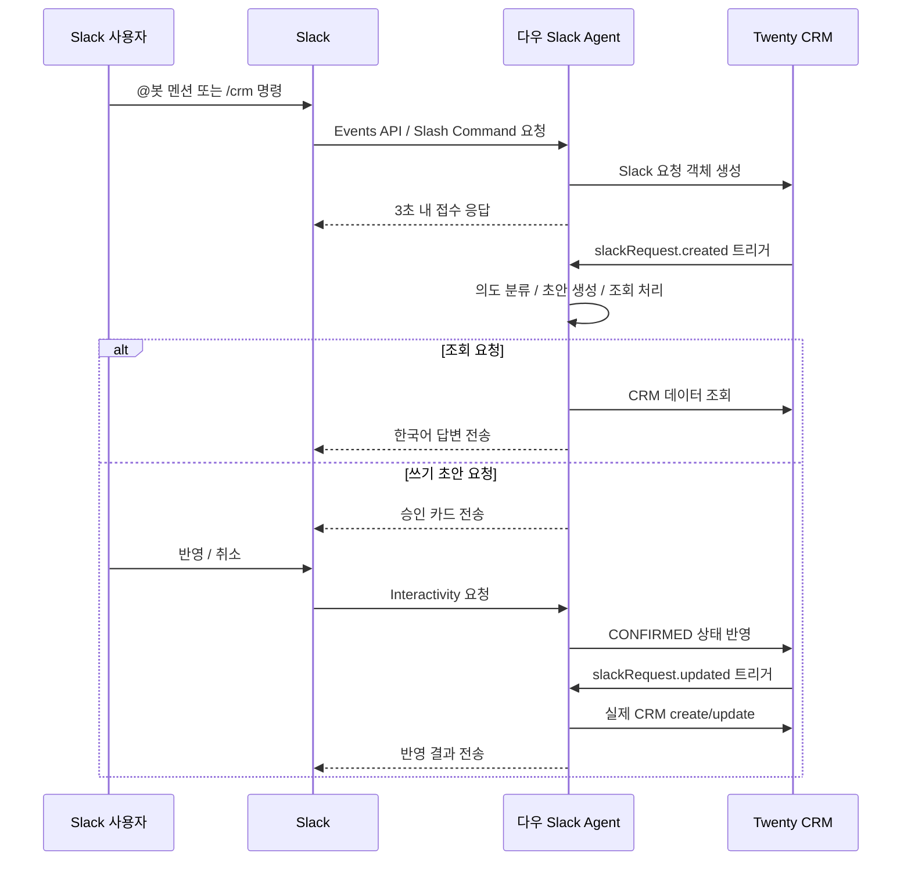

# 다우 Slack Agent

`다우 Slack Agent`는 Slack에서 올라오는 한국어 영업 대화를 읽고, Twenty CRM 데이터를 조회하거나 CRM 반영 초안을 만든 뒤 Slack 승인 후 실제 반영까지 이어주는 Twenty 앱입니다.
이 저장소는 Twenty 코어를 수정하는 포크가 아니라, 독립적으로 빌드해서 tarball로 배포하는 앱 패키지입니다.

공식 Twenty 앱 문서:
- [Getting Started](https://docs.twenty.com/developers/extend/apps/getting-started)
- [Publishing](https://docs.twenty.com/developers/extend/apps/publishing)

## 1. 이 앱이 하는 일

이 앱은 Slack과 Twenty 사이에 다음 역할을 맡습니다.

- Slack `@멘션`, `/crm` 슬래시 커맨드, 승인 버튼 인터랙션을 수신합니다.
- 사용자의 한국어 메시지를 `조회`, `쓰기 초안`, `승인 액션`으로 분류합니다.
- 조회 요청이면 Twenty CRM 데이터를 검색해 한국어 답변을 생성합니다.
- 입력 요청이면 회사, 담당자, 영업기회, 솔루션, 노트, 작업 등에 대한 CRM 반영 초안을 생성합니다.
- 초안은 바로 반영하지 않고 Slack 승인 카드를 보낸 뒤, 사용자가 승인하면 실제 CRM에 반영합니다.
- 모든 요청과 결과를 `Slack 요청` 객체에 저장해 운영 이력과 오류를 추적합니다.
- 영업기회 점검, 단계 점검, 주간 브리핑, 월간 업셀 추천 같은 운영 자동화를 실행합니다.

## 2. 전체 동작 흐름



핵심 원칙은 두 가지입니다.

- Slack 진입점에서는 무거운 처리를 하지 않고 `Slack 요청` 객체만 만든 뒤 빠르게 응답합니다.
- CRM 쓰기 작업은 반드시 Slack 승인 이후에만 실행합니다.

## 3. Twenty 안에 설치되는 리소스

### 3.1 객체

이 앱은 `Slack 요청`이라는 운영 객체를 생성합니다.

주요 필드:
- `요청명`
- `입력 경로`
- `의도`
- `처리 상태`
- `원문`
- `정규화 텍스트`
- `초안 JSON`
- `결과 JSON`
- `오류 메시지`
- `중복 방지 키`
- `승인자 Slack User ID`
- `수신 시각`
- `마지막 처리 시각`

처리 상태 정의:
- `RECEIVED`: Slack에서 요청을 접수한 상태
- `CLASSIFIED`: AI 분류가 끝난 상태
- `AWAITING_CONFIRMATION`: 승인 대기 상태
- `CONFIRMED`: Slack에서 승인 버튼을 누른 상태
- `APPLIED`: CRM 반영 완료 상태
- `ANSWERED`: 조회 응답 완료 상태
- `REJECTED`: 사용자가 취소한 상태
- `ERROR`: 처리 중 오류가 발생한 상태

주의:
- 현재 `approvedByWorkspaceMemberId` 필드에는 실제 Twenty workspace member id가 아니라 Slack user id가 저장됩니다.

### 3.2 뷰와 내비게이션

설치 후 아래 운영 뷰가 생성됩니다.

- `전체 Slack 요청`
- `승인 대기`
- `오류`
- `질의 이력`
- `쓰기 초안 이력`

좌측 사이드바에는 `Slack 요청` 메뉴가 추가됩니다.

### 3.3 HTTP 엔드포인트

이 앱은 아래 세 개의 공개 HTTP route를 제공합니다.

- `POST /s/slack/events`
- `POST /s/slack/commands`
- `POST /s/slack/interactivity`

각 엔드포인트는 Slack 서명을 검증하고, 허용 채널 검사 후 `Slack 요청` 객체를 생성하거나 승인/거절 액션을 처리합니다.

### 3.4 로직 함수와 자동화

핵심 로직 함수:

- `slack-events-route`
- `slack-commands-route`
- `slack-interactivity-route`
- `process-slack-intake`
- `answer-crm-query`
- `build-crm-write-draft`
- `apply-approved-draft`
- `post-slack-message`
- `notify-admin`

운영 자동화:

- `process-slack-intake`
  `slackRequest.created` 발생 시 의도 분류, 조회 응답, 초안 생성 처리
- `apply-approved-draft`
  `slackRequest.updated` 이후 `processingStatus = CONFIRMED`일 때 실제 CRM 반영
- `daily-opportunity-health`
  매일 실행되는 영업기회 건강도 점검
- `opportunity-stage-automation`
  영업기회 단계 변경 시 누락 정보 점검
- `note-structuring`
  `note.created` 시 후속 작업 후보 생성
- `weekly-briefing`
  매주 월요일 브리핑 생성
- `monthly-upsell`
  매월 업셀 후보 요약 생성

현재 cron 설정값:
- `daily-opportunity-health`: `0 0 * * *`
- `weekly-briefing`: `0 0 * * 1`
- `monthly-upsell`: `0 0 1 * *`

주의:
- cron 해석 기준 시각은 Twenty 서버 운영 환경에 따라 달라질 수 있습니다. 운영 서버의 timezone 정책을 확인해야 합니다.

## 4. 주요 기능

### 4.1 Slack에서 CRM 조회

예시:

- `@agent 이번달 신규 영업기회 알려줘`
- `/crm 미래금융 기회 상태 보여줘`
- `/crm 리스크 딜 알려줘`

동작:

1. 메시지를 `QUERY`로 분류합니다.
2. Twenty CRM 데이터를 조회합니다.
3. 한국어 요약 답변을 Slack 스레드에 보냅니다.
4. 결과 요약은 `Slack 요청.resultJson`에 남깁니다.

### 4.2 Slack에서 CRM 반영 초안 생성

예시:

- `/crm 미래금융이 Citrix VDI 검토 중이고 에이맥스 공동영업 예정`
- `@agent 오늘 미팅 내용 CRM에 반영해줘`

동작:

1. 메시지를 `WRITE_DRAFT`로 분류합니다.
2. AI가 CRM 반영 초안을 만듭니다.
3. Slack 승인 카드가 올라갑니다.
4. 사용자가 `반영`을 누르면 실제 CRM create/update가 실행됩니다.
5. 사용자가 `취소`를 누르면 `REJECTED` 상태로 종료됩니다.

### 4.3 운영 자동화

현재 포함된 자동화는 아래와 같습니다.

- 영업기회 건강도 점검
  벤더, 파트너, 솔루션 누락과 장기 미갱신 영업기회를 점검합니다.
- 단계 변경 점검
  특정 단계에서 필요한 보완 작업을 생성합니다.
- 노트 구조화
  노트 본문에서 액션 아이템 후보를 뽑아 작업으로 만듭니다.
- 주간 브리핑
  영업기회 수, 정체 딜, 오픈 작업 수를 요약해 관리 채널에 보냅니다.
- 월간 업셀 추천
  수주 이력이 있지만 현재 열린 기회가 없는 회사를 후보로 추립니다.

## 5. Slack에서 사용하는 방법

### 5.1 사용자 사용법

사용자는 아래 세 가지 방식으로 앱을 사용할 수 있습니다.

1. 채널에서 앱을 멘션합니다.
   예: `@다우 Slack Agent 이번달 신규 기회 알려줘`
2. `/crm` 슬래시 커맨드를 사용합니다.
   예: `/crm 미래금융 딜 상태 알려줘`
3. 앱이 만든 승인 카드에서 `반영` 또는 `취소` 버튼을 누릅니다.

### 5.2 권장 사용 패턴

- 조회 요청은 질문형 문장으로 보냅니다.
- 입력 요청은 회사명, 담당자, 기회명, 솔루션, 메모 내용을 가능한 한 구체적으로 씁니다.
- 정보가 불완전하면 앱은 note/task 위주 초안을 만들 수 있습니다.
- 실제 데이터 변경은 승인 이후에만 일어납니다.

## 6. Slack App 설정

Slack 쪽에서는 아래 URL을 각각 등록해야 합니다.

- Events API Request URL
  `https://<your-twenty-domain>/s/slack/events`
- Slash Command `/crm` Request URL
  `https://<your-twenty-domain>/s/slack/commands`
- Interactivity Request URL
  `https://<your-twenty-domain>/s/slack/interactivity`

권장 Bot Token Scope:

- `app_mentions:read`
- `chat:write`
- `commands`

상황에 따라 추가로 검토할 수 있는 Scope:

- `chat:write.public`
  봇이 아직 참여하지 않은 공개 채널에도 운영 브리핑을 보내야 할 때

주의:
- 현재 구현은 이메일 기반 사용자 권한 매핑을 실제로 사용하지 않으므로 `users:read.email`은 필수 범위가 아닙니다.
- Events API에서는 `app_mention` 이벤트를 구독해야 합니다.

## 7. 배포 방식

이 앱은 Twenty 코어를 다시 빌드하지 않고, tarball을 Twenty 서버에 업로드하는 방식으로 배포합니다.

배포 전제:

- Twenty 서버 URL이 있어야 합니다.
- Twenty API key가 있어야 합니다.
- 이미 같은 앱을 배포한 적이 있으면 `package.json`의 `version`을 올려야 합니다.

### 7.1 일반적인 배포 순서

```bash
yarn twenty remote add --api-url https://<your-twenty-domain> --api-key <your-api-key> --as production
yarn twenty deploy --remote production
yarn twenty install --remote production
```

설치 후에는 Twenty UI의 `Settings > Applications`에서도 앱 설치 상태를 확인할 수 있습니다.

### 7.2 Windows에서 Azure Linux Twenty 서버로 배포할 때

이 저장소는 Windows에서 빌드한 manifest 경로를 Linux 서버가 그대로 읽다가 깨지는 문제를 피하기 위해 `linux-safe` 배포 스크립트를 같이 제공합니다.

권장 명령:

```bash
yarn deploy:linux-safe --remote production --install
```

이 스크립트가 하는 일:

- build 결과의 Windows 경로 구분자를 POSIX 경로로 정규화
- 설치 시 필요한 metadata 요청 헤더를 보정
- role permission flag shape를 Twenty 서버가 기대하는 형태로 정규화
- install 실패 시 GraphQL validation 세부 오류를 그대로 출력

운영 환경이 Azure Linux VM이거나, 로컬 개발 환경이 Windows인 경우에는 이 명령을 우선 사용하는 것이 안전합니다.

### 7.3 배포 후 확인할 것

1. `Settings > Applications`에서 앱이 설치되었는지 확인
2. 앱 변수와 서버 변수를 모두 입력했는지 확인
3. Slack App Request URL이 올바른지 확인
4. Slack 채널에서 `@멘션` 또는 `/crm` 테스트 메시지를 보내 동작 확인

## 8. 설치 후 초기 설정값

이 앱은 Twenty의 앱 설정 화면에서 `앱 변수`와 `서버 변수`를 입력해야 정상 동작합니다.

### 8.1 앱 변수

| 변수명 | 필수 | 설명 | 권장 예시 | 비워둘 때 동작 |
| --- | --- | --- | --- | --- |
| `ALLOWED_CHANNEL_IDS` | 선택 | 처리 허용 Slack 채널 ID 목록. 쉼표 구분 | `C01234567,C07654321` | 비어 있으면 모든 채널 허용 |
| `ADMIN_SLACK_USER_IDS` | 선택 | 향후 관리자 DM/운영 알림 확장을 위한 예약 변수. 현재 버전에서는 직접 사용하지 않음 | `U01AAAAAA,U02BBBBBB` | 영향 없음 |
| `MANAGEMENT_CHANNEL_ID` | 선택 | 주간 브리핑과 운영 요약을 보낼 채널 ID | `C09MANAGER1` | 비어 있으면 관리 채널 전송 생략 |
| `VENDOR_ALIGNED_STAGE_VALUES` | 선택 | 주 벤더가 있어야 하는 영업기회 단계 값 목록 | `VENDOR_ALIGNED,DISCOVERY_POC,QUOTED,NEGOTIATION,CLOSED_WON,CLOSED_LOST,ON_HOLD` | 코드 기본값 사용 |
| `QUOTE_STAGE_VALUES` | 선택 | 솔루션/파트너 체크가 필요한 단계 값 목록 | `QUOTED,NEGOTIATION,CLOSED_WON,CLOSED_LOST` | 코드 기본값 사용 |

### 8.2 서버 변수

| 변수명 | 필수 | 설명 | 권장 예시 | 기본값 |
| --- | --- | --- | --- | --- |
| `SLACK_BOT_TOKEN` | 필수 | Slack 응답 전송용 봇 토큰 | `xoxb-...` | 없음 |
| `SLACK_SIGNING_SECRET` | 필수 | Slack 서명 검증용 secret | `abcd1234...` | 없음 |
| `SLACK_VERIFICATION_TOKEN` | 선택 | raw body 검증이 어려운 환경에서 쓰는 fallback token | Slack 앱의 legacy token | 없음 |
| `SLACK_APP_TOKEN` | 선택 | 향후 Socket Mode 대응용 app token | `xapp-...` | 없음 |
| `OPENAI_API_KEY` | 필수 | 의도 분류와 초안 생성을 위한 OpenAI API key | `sk-...` | 없음 |
| `OPENAI_MODEL` | 선택 | OpenAI 모델 ID | `gpt-4o-mini` | `gpt-4o-mini` |
| `TWENTY_BASE_URL` | 필수 | Slack 답변에 넣을 Twenty 레코드 링크의 기준 URL | `https://crm.example.com` | 없음 |

초기 설정 권장값:

- 운영 시작 전에는 `ALLOWED_CHANNEL_IDS`를 꼭 지정하는 편이 안전합니다.
- `MANAGEMENT_CHANNEL_ID`를 비우면 주간 브리핑과 운영 요약은 Slack으로 전송되지 않습니다.
- `OPENAI_MODEL`을 비우면 기본값 `gpt-4o-mini`를 사용합니다.

## 9. 로컬 개발

기본 명령:

```bash
yarn
yarn lint
yarn typecheck
yarn test
yarn build
```

통합 테스트:

```bash
RUN_TWENTY_INTEGRATION_TESTS=true yarn test:integration
```

배포 산출물은 `.twenty/output` 아래에 생성됩니다.

## 10. 운영 체크리스트

운영 시작 전에 아래를 확인하는 것이 좋습니다.

1. Twenty 앱이 설치되어 있는가
2. `SLACK_BOT_TOKEN`, `SLACK_SIGNING_SECRET`, `OPENAI_API_KEY`, `TWENTY_BASE_URL`가 모두 입력되어 있는가
3. Slack App Request URL이 현재 Twenty 도메인과 일치하는가
4. 봇이 실제로 사용할 채널에 초대되어 있는가
5. `ALLOWED_CHANNEL_IDS`가 의도한 운영 채널과 맞는가
6. 주간 브리핑용 `MANAGEMENT_CHANNEL_ID`가 필요한 경우 설정되어 있는가

## 11. 트러블슈팅

### 11.1 설치는 되는데 앱이 동작하지 않을 때

먼저 아래를 확인합니다.

- 앱 변수와 서버 변수가 비어 있지 않은지
- Slack App URL이 현재 배포 도메인을 가리키는지
- Slack 봇이 채널에 참여해 있는지
- `ALLOWED_CHANNEL_IDS`가 현재 채널을 막고 있지 않은지

### 11.2 Windows에서 빌드한 뒤 Azure Linux Twenty 서버에 설치가 안 될 때

일반 `yarn twenty deploy` 대신 아래 명령을 사용합니다.

```bash
yarn deploy:linux-safe --remote production --install
```

이유:

- Windows manifest 경로가 Linux 설치 환경과 충돌할 수 있습니다.
- custom deploy 스크립트가 path normalization과 install 오류 상세 출력을 함께 처리합니다.

### 11.3 `Validation errors occurred while syncing application manifest metadata`가 보일 때

이 메시지는 실제 원인을 숨기는 상위 오류인 경우가 많습니다.
이 저장소의 `deploy:linux-safe` 스크립트는 가능하면 GraphQL `extensions.errors` 상세 payload를 출력하도록 되어 있으므로, 같은 문제가 다시 나면 해당 출력 기준으로 원인을 좁히는 것이 좋습니다.

### 11.4 같은 버전으로 다시 배포가 안 될 때

Twenty 앱은 같은 버전 재업로드가 막힐 수 있으므로 `package.json`의 `version`을 올린 뒤 다시 배포해야 합니다.

## 12. 현재 제약

- 승인자 필드는 현재 Slack user id를 저장합니다.
- 사용자 이메일 기반의 Twenty workspace member 권한 매핑은 아직 구현되지 않았습니다.
- front component는 아직 없고, 현재 앱은 객체/뷰/로직 함수 중심 구성입니다.
- Slack 전체 채널 수집이 아니라 `@멘션`, `/crm`, 인터랙션 요청 중심으로 동작합니다.

## 13. 빠른 시작 예시

1. Twenty 서버 remote 등록

```bash
yarn twenty remote add --api-url https://crm.example.com --api-key <api-key> --as production
```

2. Windows에서 Azure Linux 서버로 배포

```bash
yarn deploy:linux-safe --remote production --install
```

3. Twenty에서 앱 변수/서버 변수 입력

4. Slack App URL 등록

- Events API: `https://crm.example.com/s/slack/events`
- Slash Command: `https://crm.example.com/s/slack/commands`
- Interactivity: `https://crm.example.com/s/slack/interactivity`

5. Slack에서 테스트

```text
@다우 Slack Agent 이번달 신규 영업기회 알려줘
/crm 미래금융이 Citrix VDI 검토 중이고 에이맥스 공동영업 예정
```

6. 승인 카드에서 `반영` 버튼 클릭

## 14. 참고

- Twenty 앱 공식 문서: [Getting Started](https://docs.twenty.com/developers/extend/apps/getting-started)
- Twenty 앱 배포 문서: [Publishing](https://docs.twenty.com/developers/extend/apps/publishing)
- Twenty 예제 앱: [postcard example](https://github.com/twentyhq/twenty/tree/main/packages/twenty-apps/examples/postcard)
